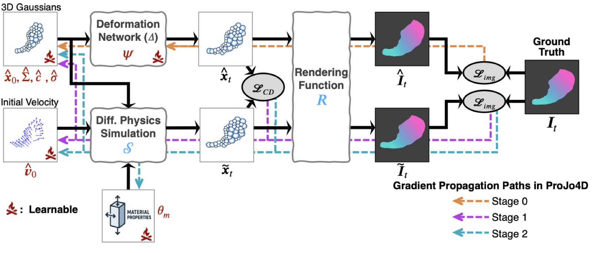

# ProJo4D: Progressive Joint Optimization for Sparse-View Inverse Physics Estimation

**Transactions on Machine Learning Research (TMLR), 2026**

[Paper (OpenReview)](https://openreview.net/forum?id=pqvVrqlXCZ) | [arXiv](https://arxiv.org/abs/2506.05317) | [Project Page](https://daniel03c1.github.io/ProJo4D/)



## TL;DR

Estimating 4D geometry and physical parameters from sparse multi-view video is hard: sequential pipelines accumulate errors, while fully joint optimization is unstable on the non-convex landscape. ProJo4D's **progressive joint optimization** gradually expands the set of jointly optimized variables, achieving consistent improvements across synthetic and real-world benchmarks.

## Installation

- Python 3.9
- CUDA 12.1
- PyTorch 2.4.0

```bash
git clone https://github.com/daniel03c1/projo4d
cd projo4d

conda create -n projo4d -y python=3.9
conda install -n projo4d -y -c nvidia "cuda-toolkit=12.1" "cuda-version=12.1"
conda activate projo4d
pip install torch==2.4.0 torchvision==0.19.0 --index-url https://download.pytorch.org/whl/cu121

git clone https://github.com/g-truc/glm.git submodules/diff_gauss/third_party/glm
cd submodules/diff_gauss/third_party/glm/
git checkout 5c46b9c07008ae65cb81ab79cd677ecc1934b903
cd ../../../../
pip install submodules/diff_gauss --no-build-isolation

pip install git+https://github.com/facebookresearch/pytorch3d.git --no-build-isolation
pip install git+https://gitlab.inria.fr/bkerbl/simple-knn.git --no-build-isolation

pip install taichi==1.4.0 tqdm matplotlib trimesh opencv-python plyfile einops scipy open3d
```

## Data preparation

ProJo4D is evaluated on three datasets:

- **PAC-NeRF**: synthetic, dense-view. [project page](https://xuan-li.github.io/PAC-NeRF/)
- **Spring-Gaus**: synthetic, sparse-view evaluation. [project page](https://zlicheng.com/spring_gaus/)
- **Spring-Gaus Real-world**: real captures, sparse-view evaluation. Released with Spring-Gaus.

Download the data from the respective project pages. The `-s` flag always takes the scene's own root folder; the code auto-detects the dataset type from its contents.

### PAC-NeRF

```
<root>/
  pacnerf/
    elastic/
      0/               <- pass this as -s
        all_data.json
        ...
      elastic.json     <- GT physical params (sibling of the scene folder)
  simulation_data/     <- GT point clouds (sibling of pacnerf/)
    elastic/
      0/
        000.ply  001.ply  ...
```

Before training, run the preprocessing script (bundled from GIC) to generate the masked images and camera transforms that the training code expects:

```bash
python prepare_pacnerf_data.py --data_folder data/pacnerf/elastic/0
```

This requires a matting model checkpoint at `data/checkpoint/pytorch_resnet101.pth`.
For more details, see the [GIC project page](https://jukgei.github.io/project/gic).

### Spring-Gaus synthetic

The scene folder must sit inside a parent directory named `render`; the code locates GT point clouds by replacing `render` with `simulation` in the path.

```
<root>/
  render/
    apple/             <- pass this as -s
      camera.json
      frame.json
      camera_*/
      physical.json    <- GT physical params
  simulation/
    apple/             <- GT point clouds
      000.ply  001.ply  ...
```

### Spring-Gaus real-world

The path passed to `-s` must contain the string `real_capture` (used as the dataset type trigger):

```
<root>/
  real_capture/
    <scene_name>/      <- pass this as -s
      static/
      dynamic/
        sequences/
        cameras_calib.json
        videos_images/
        videos_masks/
```

### Custom dataset

To add a new dataset, two places need changes:

- **Data loading**: add a reader function in `scene/dataset_readers.py` and register it in the `sceneLoadTypeCallbacks` dict at the bottom of that file. `scene/__init__.py` routes to the right reader based on what files are present in the source path.
- **GT evaluation**: extend the if/elif branches in `utils/data_utils.py::load_gt_pcds` (point clouds) and `train_projo4d.py::load_gt_params` (physical params). Both are called automatically at the end of training and from `predict.py`.

## Training

`train_projo4d.py` runs the full progressive joint optimization pipeline (4D Gaussian reconstruction, deformation, and physical parameter estimation) from a single entry point. Configs for each dataset and material live under `config/`. Evaluation runs automatically at the end of training: predicted physical parameters land in `projo4d_pred*.json` and eval metrics in `projo4d_perf*.json` (see [Outputs](#outputs)); there is no separate evaluation script to invoke.

The three required flags are:

- `-c`: path to the experiment config (`projo4d.json`)
- `-s`: source dataset directory
- `-m`: output directory for checkpoints, renders, and logs

Other commonly used flags:

- `--cam_idxs`: subset of camera indices for sparse-view training (e.g. `1 5 9`). Omit to use all cameras.
- `--postfix`: suffix appended to top-level output filenames so multiple variants can coexist in the same `-m` directory. See [Run tags](#run-tags---postfix).

```bash
# Dense-view setting (all cameras)
python train_projo4d.py -c config/pacnerf/elastic/projo4d.json \
                        -s data/pacnerf/elastic/0 \
                        -m output/pacnerf/elastic_0

# Sparse-view setting (3 cameras: 1, 5, 9)
python train_projo4d.py -c config/pacnerf/elastic/projo4d.json \
                        -s data/pacnerf/elastic/0 \
                        -m output/pacnerf/elastic_0_CAM1,5,9 \
                        --cam_idxs 1 5 9
```

### Optimization strategies

Three flags control the progressive joint optimization schedule. **CLI values take priority over the config file** for all three, so you can explore different schedules without editing any JSON.

| Flag | Default | Description |
|---|---|---|
| `--stage_codes` | *(required -- set in every shipped config)* | Comma-separated stage tags that drive the schedule, e.g. `"SG,SMG"` |
| `--n_chunk_steps` | `100` (or config value) | Gradient steps per stage tag |
| `--n_repeat` | `1` | How many times to cycle the full tag list |

Each tag selects which variables are updated during that stage. Letters inside a tag are unordered (`"SG"` and `"GS"` are equivalent):

| Letter | Variables updated |
|---|---|
| `S` | state: physical state, such as `init_vel`, `gravity` |
| `M` | material: material parameters |
| `G` | **all** Gaussian attributes (shorthand for `A` + `X`) |
| `A` | all Gaussian attributes, except positions |
| `X` | Gaussian positions only |

Total iterations = `len(stage_codes) * n_repeat * n_chunk_steps`.

**Trying a different schedule.** Pass the three flags on the CLI and they override the config:

```bash
# 5 stages x 100 steps x 1 repeat = 500 iterations
python train_projo4d.py -c config/pacnerf/elastic/projo4d.json \
                        -s data/pacnerf/elastic/0 \
                        -m output/pacnerf/elastic_0 \
                        --stage_codes "SG,SG,SMG,SMG,SMG" \
                        --n_chunk_steps 100 \
                        --n_repeat 1
```

| Iters | Tag | What is optimized |
|---|---|---|
| 0-199 | `SG` | state + all Gaussians (warm up shape and velocity before adding materials) |
| 200-499 | `SMG` | state + material + all Gaussians (full joint optimization) |

**Repeating the schedule.** `--n_repeat 3` runs the tag list three times, tripling the total iterations without changing the relative proportions:

```bash
python train_projo4d.py -c config/spring_gaus/mpm_synthetic/apple_projo4d.json \
                        -s data/mpm_synthetic/render/apple \
                        -m output/spring_gaus/apple \
                        --stage_codes "SG,SMG" \
                        --n_chunk_steps 100 \
                        --n_repeat 3
```

This runs 2 stages x 100 steps x 3 repeats = 600 total iterations, cycling `SG -> SMG -> SG -> SMG -> SG -> SMG`.


### Run tags (`--postfix`)

Use `--postfix` to label experiment variants so their outputs coexist in the same `-m` directory:

```bash
python train_projo4d.py -c config/pacnerf/elastic/projo4d.json \
                        -s data/pacnerf/elastic/0 \
                        -m output/pacnerf/elastic_0 \
                        --postfix POSTFIX
```

The value is appended to top-level output filenames (`projo4d_pred_POSTFIX.json`, `projo4d_perf_POSTFIX.json`, `projo4d_gaussian_POSTFIX.ply`, `projo4d_renders_POSTFIX/`).


## Outputs

Each run writes into the `-m` directory. Top-level files are pipeline-prefixed so it is obvious which script wrote what:

| File / folder | Pipeline | Contents |
|---|---|---|
| `gt_renders/` | shared | Per-frame ground-truth renders |
| `point_cloud/`, `point_cloud_fix_pcd/`, `gs/`, `deform/`, `mpm/`, `img/` | shared | Per-iteration checkpoints and debug snapshots |
| `projo4d_pred{postfix}.json` | ProJo4D | Estimated physical parameters (velocity, gravity, material params) |
| `projo4d_perf{postfix}.json` | ProJo4D | Eval metrics (PSNR, SSIM, CD, EMD, MAE vs. GT params) |
| `projo4d_gaussian{postfix}.ply` | ProJo4D | Final Gaussian splat after progressive joint optimization (3DGS format) |
| `projo4d_renders{postfix}/` | ProJo4D | Per-frame rendered images |
| `gic_pred.json` | GIC | Estimated physical parameters from `train_dynamic.py` |
| `gic_perf.json` | GIC | Eval metrics from `predict.py` |
| `gic_gaussian.ply` | GIC | Latest fixed-position Gaussian splat (3DGS format; mirrors `point_cloud_fix_pcd/iteration_*/point_cloud.ply`) |
| `gic_renders/` | GIC | Per-frame rendered images + per-camera GIFs/MP4s from `predict.py` |


## Citation

```bibtex
@article{rho2026projo4d,
  title   = {ProJo4D: Progressive Joint Optimization for Sparse-View Inverse Physics Estimation},
  author  = {Daniel Rho and Jun Myeong Choi and Biswadip Dey and Roni Sengupta},
  journal = {Transactions on Machine Learning Research},
  year    = {2026},
  month   = {5},
  url     = {https://openreview.net/forum?id=pqvVrqlXCZ}
}
```

## Acknowledgements

This codebase is built on [Gaussian-Informed Continuum (GIC)](https://github.com/Jukgei/gic) (NeurIPS 2024 Oral).
We thank the authors of [PAC-NeRF](https://xuan-li.github.io/PAC-NeRF/) and [Spring-Gaus](https://zlicheng.com/spring_gaus/) for their datasets and code.

This work was supported by a National Institute of Health (NIH) project #1R21EB035832 *"Next-gen 3D Modeling of Endoscopy Videos"*.
